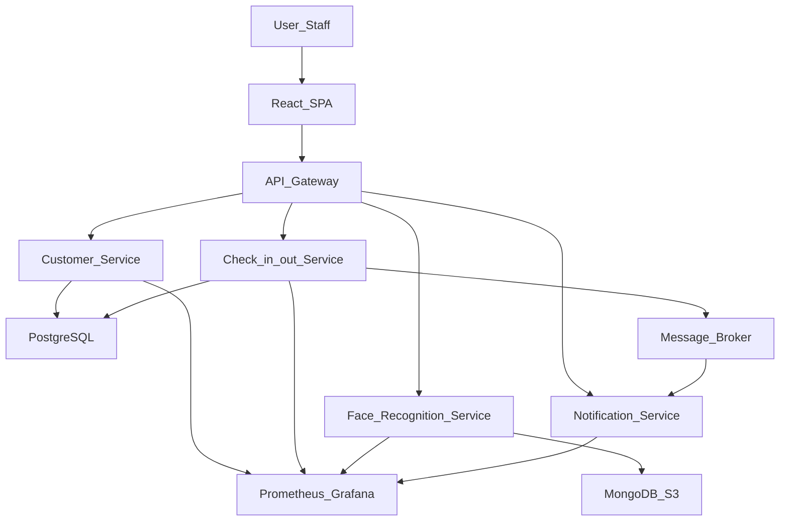

# GymFlow - System Design Document (SDD)

## 1. Giới thiệu

### 1.1 Mục tiêu

GymFlow là hệ thống quản lý khách hàng và check-in/out tại phòng gym, ứng dụng kiến trúc microservices để đảm bảo tính mở rộng, dễ bảo trì và có thể tích hợp AI nhận diện khuôn mặt.

### 1.2 Phạm vi

- Quản lý hội viên (CRUD).
- Check-in/out bằng QR hoặc nhận diện khuôn mặt.
- Ghi nhận attendance.
- Gửi thông báo nhắc nhở và thông tin.
- Dashboard quản trị trên nền web.
- Tích hợp AI để nhận diện khuôn mặt.

---

## 2. Tổng quan kiến trúc (Architecture Overview)

### 2.1 Microservices

- **Customer Service (ASP.NET Core):** CRUD khách hàng, quản lý membership.
- **Face Recognition Service (Python/FastAPI):** Nhận diện khuôn mặt, trả về member_id.
- **Check-in/out Service (ASP.NET Core):** Xử lý check-in/out, ghi attendance.
- **Notification Service (ASP.NET Core):** Gửi push/email/SMS.

### 2.2 Thành phần khác

- **Database:** PostgreSQL (transactional), MongoDB (optional cho ảnh/metadata).
- **Frontend:** React.js Admin Dashboard (SPA).
- **API Gateway:** Kong/Envoy/Traefik để điều hướng request và auth.
- **CI/CD Pipeline:** Tekton hoặc Jenkins.
- **Deployment:** Docker containers → Kubernetes / OpenShift.
- **Monitoring & Logging:** Prometheus + Grafana, centralized logs (Loki/ELK).

---

## 3. Kiến trúc hệ thống (System Architecture)

### 3.1 High-Level Architecture

### 3.2 Deployment

- Mỗi service containerized bằng Docker.
- Triển khai qua Helm/Kustomize trên Kubernetes/OpenShift.
- Namespace: `gymflow-dev`, `gymflow-stg`, `gymflow-prod`.

---

## 4. Data Model

### 4.1 PostgreSQL

- **members** (id, name, email, phone, status, created_at)
- **memberships** (id, member_id, plan, start_date, end_date, status)
- **checkins** (id, member_id, in_at, out_at, method, location_id)
- **face_embeddings** (member_id, vector_embedding, model_version, image_uri, created_at)

### 4.2 MongoDB (optional)

- **faces** { member_id, image_uri, embedding, metadata }

---

## 5. API Contracts (OpenAPI Sketch)

### 5.1 Customer Service

- `POST /api/v1/customers`
- `GET /api/v1/customers/{id}`

### 5.2 Check-in/out Service

- `POST /api/v1/checkins/qr`
- `POST /api/v1/checkins/face`

### 5.3 Face Service

- `POST /api/v1/face/register`
- `POST /api/v1/face/recognize`

### 5.4 Notification Service

- `POST /api/v1/notifications/send`

---

## 6. Workflow chính

### 6.1 Check-in bằng khuôn mặt

1. User upload ảnh → SPA gửi tới API Gateway.
2. Gateway forward tới Check-in Service.
3. Check-in Service gọi Face Service → trả về member_id hoặc unknown.
4. Nếu recognized: ghi attendance vào DB + publish event.
5. Notification Service nhận event → gửi thông báo.
6. Trả kết quả về cho người dùng.

---

## 7. CI/CD Pipeline

- **Build & Test:**

  - ASP.NET Core: `dotnet build && dotnet test`.
  - Python: `pytest`.
  - React: `npm test && npm run build`.

- **Containerize:** Build Docker image, push to registry.
- **Deploy:** Helm/Kustomize → Kubernetes/OpenShift.
- **Monitor:** Automated health checks, Prometheus metrics.

---

## 8. Monitoring & Logging

- **Prometheus:** Metrics từ tất cả services.
- **Grafana:** Dashboards cho system health, latency, error rate.
- **Centralized Logging:** Fluent Bit/Fluentd → Loki/ELK.
- **Tracing:** OpenTelemetry → Jaeger.

---

## 9. Bảo mật (Security)

- **Auth:** JWT (Auth0 / IdentityServer).
- **TLS:** Toàn bộ giao tiếp HTTPS.
- **RBAC:** Admin/staff/member phân quyền.
- **Dữ liệu khuôn mặt:** Mã hóa khi lưu trữ, tuân thủ chính sách privacy.
- **Secrets Management:** Vault / K8s secrets.

---

## 10. MVP & Roadmap

| Tính năng                     | Ưu tiên | Sprint   |
| ----------------------------- | ------- | -------- |
| Customer CRUD                 | Cao     | Sprint 1 |
| Face Recognition Check-in/out | Cao     | Sprint 2 |
| Attendance Logging            | Cao     | Sprint 2 |
| Admin Dashboard               | TB      | Sprint 2 |
| Notification                  | TB      | Sprint 3 |
| Multi-camera support          | Thấp    | Sprint 4 |
| Advanced analytics dashboard  | Thấp    | Sprint 4 |

---

## 11. Các quyết định kỹ thuật

- DB chính: PostgreSQL (kết hợp pgvector cho embeddings).
- Lưu ảnh gốc: object storage (S3/MinIO).
- Face embeddings: PostgreSQL hoặc MongoDB.
- Message broker: Kafka/RabbitMQ cho sự kiện.
- Logging: Loki/ELK stack.
- Triển khai: Kubernetes/OpenShift với Helm.

---
